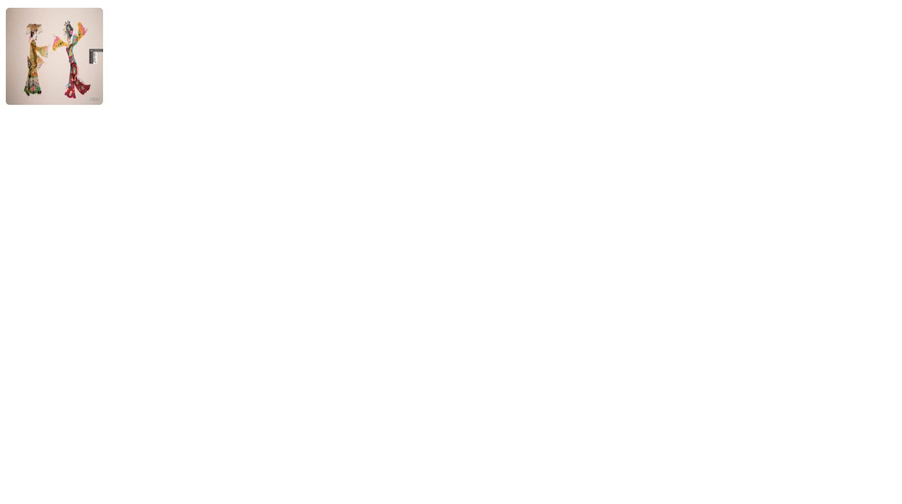

<!--
 * @Author: zhang_gen_yuan
 * @Date: 2022-09-12 22:42:37
 * @LastEditTime: 2023-08-16 14:01:38
 * @Descripttion: 
-->
# Avatar 头像




<details>
<summary>查看代码</summary>

```vue
<script lang="ts" setup>
import { Avatar } from "zgy-ui"
</script>
<template>
  <Avatar size="100" shape="square" />
</template>
```

</details>

## Attributes

| 参数| 说明 |可选值|类型|默认值| 是否必填|
|-----| ----|-----|---|-------|----|
| src| 图片路径 |- |string |  | 是 |
| size| 图片大小 [ width & height ] |- |string | 50 | 否 |
| shape| 图片形状 | circle,square |string | circle | 否 |
| fit| content-fit属性 |- |string | cover | 否 |
