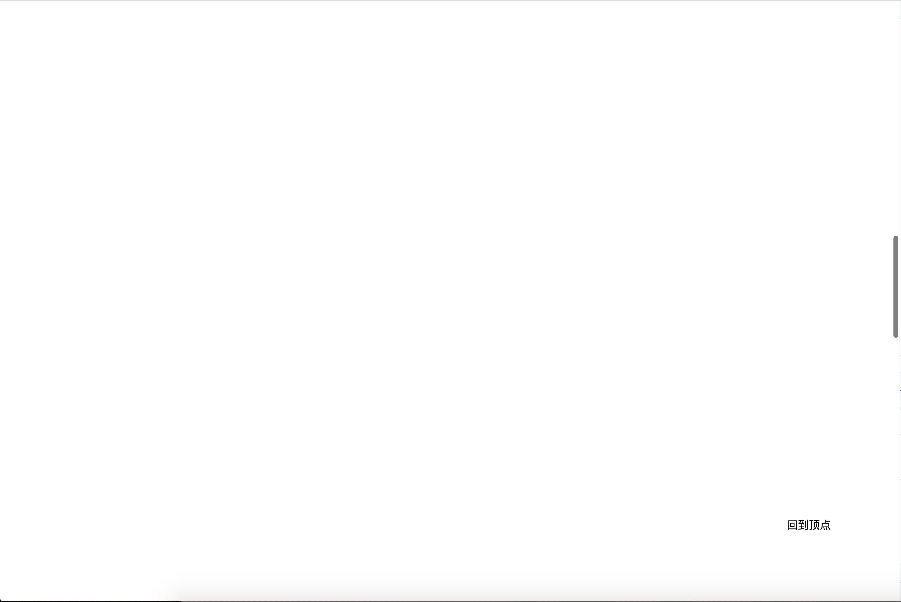

<!--
 * @Author: zhang_gen_yuan
 * @Date: 2022-09-12 22:42:37
 * @LastEditTime: 2022-09-12 22:53:12
 * @Descripttion: 
-->
# BackTop 回到顶部




<details>
<summary>查看代码</summary>

```vue
<template>
    <Backtop>回到顶点</Backtop>
</template>

<script lang="ts" setup>
import { Backtop } from "zgy-ui";
</script>
```

</details>

## Attributes

| 参数| 说明 |可选值|类型|默认值| 是否必填|
|-----| ----|-----|---|-------|----|
| target| DOM元素ID |- |string |#app |否|
| right| 距离右边距离 |-| number |100 |否|
| bottom| 距离底部距离 |-| number |100 |否|
| height| scroll距离显示 |-| number |200 |否|
