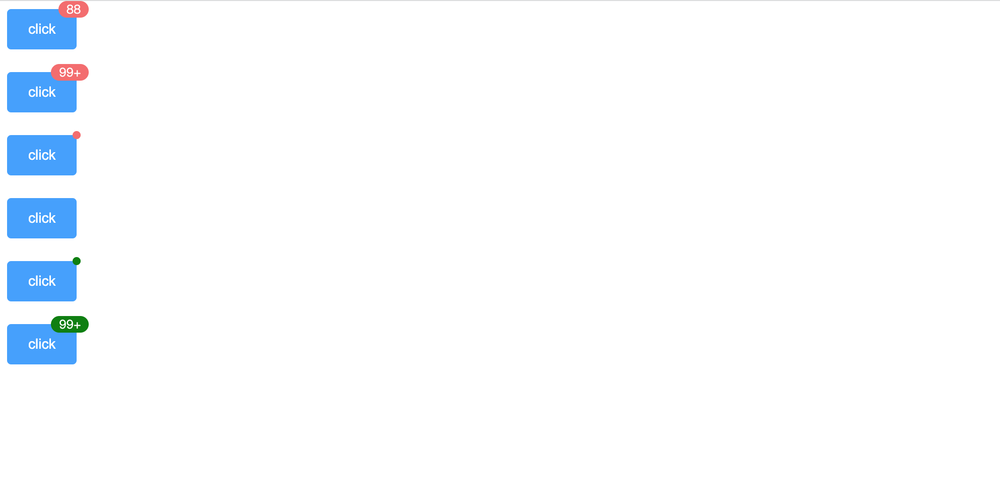

<!--
 * @Author: zhang_gen_yuan
 * @Date: 2022-09-12 22:42:37
 * @LastEditTime: 2023-08-16 15:39:00
 * @Descripttion: 
-->
# Badge 角标




<details>
<summary>查看代码</summary>

```vue
<template>
  <Badge value="88">
    <Button type="primary">click</Button>
  </Badge>
  <br />
  <Badge value="110">
    <Button type="primary">click</Button>
  </Badge>
  <br />
  <Badge value="100" :is-dot="true">
    <Button type="primary">click</Button>
  </Badge>
  <br />
  <Badge value="100" hidden="true" :is-dot="true">
    <Button type="primary">click</Button>
  </Badge>
  <br />
  <Badge value="100" bgColor="green" color="#000" :is-dot="true">
    <Button type="primary">click</Button>
  </Badge>
  <br />
  <Badge value="100" bgColor="green" color="#fff">
    <Button type="primary">click</Button>
  </Badge>
</template>

<script lang="ts" setup>
import { Badge,Button } from 'zgy-ui'
</script>
```

</details>

## Attributes

| 参数| 说明 |可选值|类型|默认值| 是否必填|
|-----| ----|-----|---|-------|----|
| value| 显示角标数字值 |- |string  number |  | 否 |
| max| 最大值，超过最大值会显示 {max}+。 只有当 value 是数字类型时起作用 |- | number | 99 | 否 |
| size| 显示角标字体大小 |- |number | 12 | 否 |
| is-dot| 是否显示小圆点 |- |boolean | false | 否 |
| hidden| 是否显示 |- |boolean | false | 否 |
| bgColor| 角标背景颜色 |- |string | #f56c6c | 否 |
| color | 角标字体颜色 |- |string | #ffffff | 否 |

