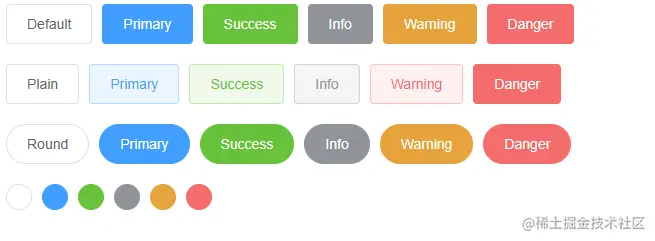
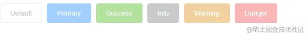
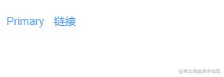

# Button按钮


## 基础用法



<details>
<summary class="more">查看代码</summary>

 ```vue
 <template>
  <div> 
    <Row :gutter="[10,20]">
      <Button>Default</Button>
      <Button type="primary">Primary</Button>
      <Button type="success">Success</Button>
      <Button type="info">Info</Button>
      <Button type="warning">Warning</Button>
      <Button type="danger">Danger</Button>
    </Row>

    <Row :gutter="[10,20]">
      <Button plain>Plain</Button>
      <Button type="primary" plain>Primary</Button>
      <Button type="success" plain>Success</Button>
      <Button type="info" plain>Info</Button>
      <Button type="warning" plain>Warning</Button>
      <Button type="danger" plain>Danger</Button>
    </Row>

    <Row :gutter="[10,20]">
      <Button round>Round</Button>
      <Button type="primary" round>Primary</Button>
      <Button type="success" round>Success</Button>
      <Button type="info" round>Info</Button>
      <Button type="warning" round>Warning</Button>
      <Button type="danger" round>Danger</Button>
    </Row>

    <Row :gutter="[10,20]">
      <Button :icon="Search" circle />
      <Button type="primary" :icon="Edit" circle />
      <Button type="success" :icon="Check" circle />
      <Button type="info" :icon="Message" circle />
      <Button type="warning" :icon="Star" circle />
      <Button type="danger" :icon="Delete" circle />
    </Row>
  </div>
</template>

<script lang="ts" setup>

import { Button,Row } from "zgy-ui";

</script>
```
</details>

## 禁用状态



<details>
<summary>查看代码</summary>

```vue
<template>
  <div>
    <Row :gutter="[10,20]">
      <Button disabled>Default</Button>
      <Button type="primary" disabled>Primary</Button>
      <Button type="success" disabled>Success</Button>
      <Button type="info" disabled>Info</Button>
      <Button type="warning" disabled>Warning</Button>
      <Button type="danger" disabled>Danger</Button>
    </Row>
  </div>
</template>

<script lang="ts" setup>
import { Button,Row } from "zgy-ui";
</script>
```
</details>


## 文字状态




<details>
<summary>查看代码</summary>

```vue
<template>
  <div>
    <Row :gutter="[10,20]">
      <Button type="text">Primary</Button>
    </Row>
  </div>
</template>

<script lang="ts" setup>
import { Button,Row } from "zgy-ui";
</script>
```
</details>

## Attributes

| 参数| 说明 |可选值|类型|默认值| 
|-----| ----|-----|---|-------|
| type| 类型 | 'primary', 'success', 'info', 'warning', 'danger', 'text'|string|- |
| plain|朴素按钮| - |boolean| false |
|round|是否圆角| - |boolean| false |
|circle|是否圆形| - |boolean| false |
|disabled|是否禁用| - |boolean| false |