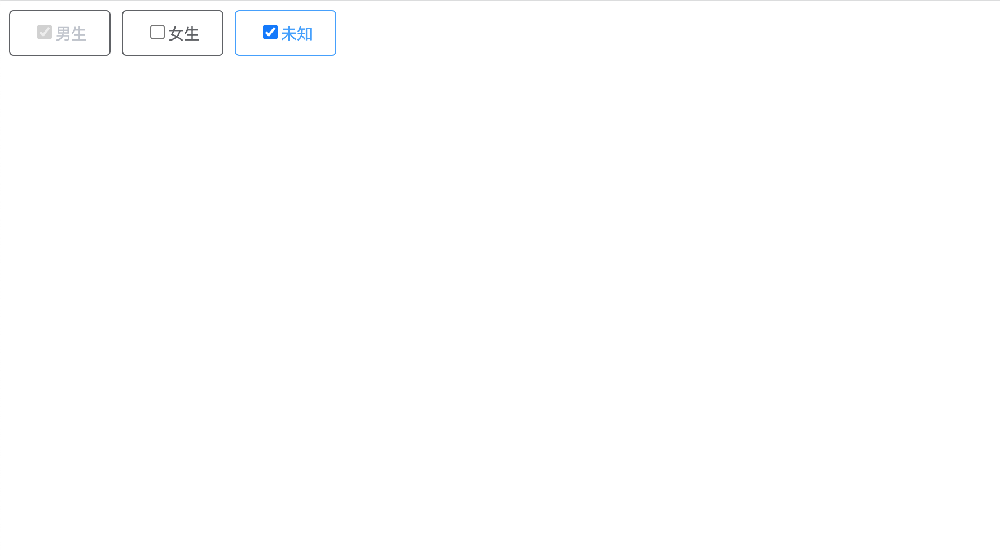

<!--
 * @Author: zhang_gen_yuan
 * @Date: 2022-09-12 22:42:37
 * @LastEditTime: 2023-08-30 16:03:22
 * @Descripttion: 
-->
# Checkbox 复选框




<details>
<summary>查看代码</summary>

```vue
<script setup lang="ts">
import { Checkbox } from "zgy-ui";
import { ref } from "vue"
const clist = ref([
  {
    value:"1",
    name:"男生",
    disabled:true
  },
  {
    value:"2",
    name:"女生"
  },
  {
    value:"3",
    name:"未知"
  }
])
const value = ref(['1'])
const getCheckedList = (list:any)=>{
  console.log("选中的",list)
}
</script>
<template>
  <Checkbox border :list="clist" :value="value" @getCheckedList="getCheckedList"></Checkbox>
</template>
```

</details>

## Attributes

| 参数| 说明 |可选值|类型|默认值| 是否必填|
|-----| ----|-----|---|-------|----|
| list | 复选框列表  | - | Array< CustomAttr> | - | 是 |
| value| 选中的列表 |- | Array | '' | 否 |
| border| 是否显示边框 | -  | boolean | false | 否 |


## CustomAttr

| 参数| 说明 |可选值|类型|默认值| 是否必填|
|-----| ----|-----|---|-------|----|
| name | 复选框展示内容 | - | string | - | 是 |
| value | 复选框选中内容对应的值 | - | - | - | 是 |
| disabled | 是否禁用 | - | boolean | false | 否 |