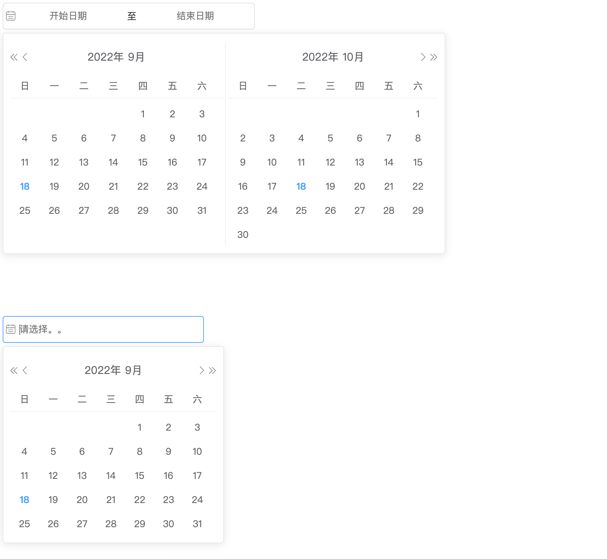

<!--
 * @Author: zhang_gen_yuan
 * @Date: 2022-09-11 19:02:06
 * @LastEditTime: 2022-09-18 18:00:58
 * @Descripttion:
-->

# DatePicker 日期选择器



<details>
<summary>查看代码</summary>

```vue
<template>
  <DatePicker v-model="daterange" separator="-" clearable type="daterange" />
  <DatePicker
    v-model="date"
    separator="/"
    placeholder="请选择。。"
    clearable
    style="width:300px;"
  />
</template>

<script lang="ts" setup>
import { DatePicker } from "zgy-ui";
import { ref } from "vue";

const daterange = ref([]);
const date = ref("");
</script>
```

</details>

## Attributes

| 参数                 | 说明                          | 可选值         | 类型            | 默认值              | 是否必填 |
| -------------------- | ----------------------------- | -------------- | --------------- | ------------------- | -------- |
| modelValue / v-model | 绑定值                        | -              | string/string[] | -                   | 是       |
| type                 | 类型                          | date/daterange | string          | date                | 否       |
| readonly             | 是否只读                      | -              | boolean         | false               | 否       |
| readonly             | 是否只读                      | -              | boolean         | false               | 否       |
| disabled             | 是否禁用                      | -              | boolean         | false               | 否       |
| clearable            | 是否显示关闭按钮              | -              | boolean         | false               | 否       |
| placeholder          | 提示占位符                    | -              | string          | -                   | 否       |
| separator            | 分隔符                        | -              | string          | '-'                 | 否       |
| defaultValue         | 默认值,必须以-为分隔符        | -              | string          | 当前日期/2022-09-18 | 否       |
| rangeSeparator       | 分隔 type==='daterange'时有效 | -              | string          | 至                  | 否       |
| startPlaceholder     | 开始时间 placeholder          | -              | string          | 开始日期            | 否       |
| endPlaceholder       | 结束时间 placeholder          | -              | string          | 结束日期            | 否       |
