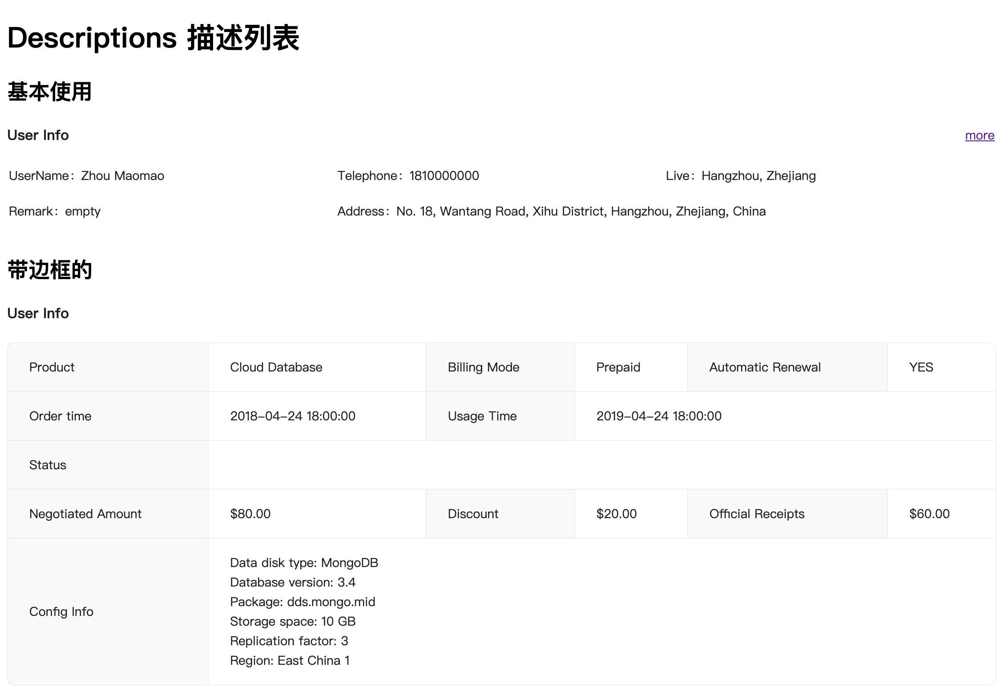
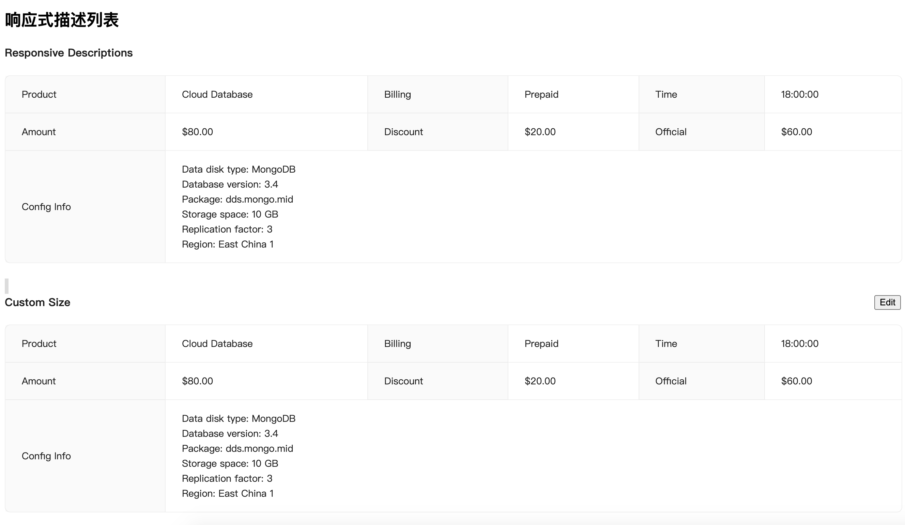
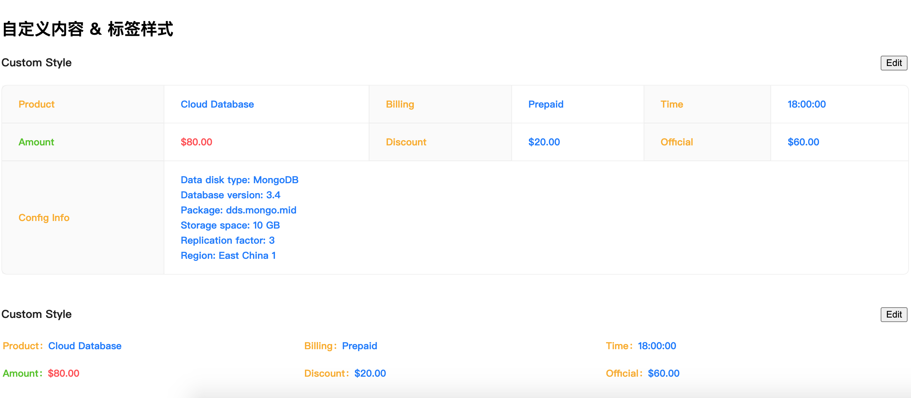

<!--
 * @Author: zhang_gen_yuan
 * @Date: 2022-09-12 22:42:37
 * @LastEditTime: 2023-08-22 18:11:13
 * @Descripttion: 
-->
# Descriptions 描述列表 






<details>
<summary>查看代码</summary>

```vue
<script setup lang="ts">
import { Descriptions,DescriptionsItem } from "zgy-ui"
</script>
<template>
  <div>
    <h1>Descriptions 描述列表</h1>
    <h2 class="mt30 mb10">基本使用</h2>
    <Descriptions title="User Info">
      <template #extra>
        <a href="#">more</a>
      </template>
      <DescriptionsItem label="UserName">Zhou Maomao</DescriptionsItem>
      <DescriptionsItem label="Telephone">1810000000</DescriptionsItem>
      <DescriptionsItem label="Live">Hangzhou, Zhejiang</DescriptionsItem>
      <DescriptionsItem label="Remark">empty</DescriptionsItem>
      <DescriptionsItem label="Address">
        No. 18, Wantang Road, Xihu District, Hangzhou, Zhejiang, China
      </DescriptionsItem>
    </Descriptions>
    <h2 class="mt30 mb10">带边框的</h2>
    <Descriptions title="User Info" bordered>
      <DescriptionsItem label="Product">Cloud Database</DescriptionsItem>
      <DescriptionsItem label="Billing Mode">Prepaid</DescriptionsItem>
      <DescriptionsItem label="Automatic Renewal">YES</DescriptionsItem>
      <DescriptionsItem label="Order time">2018-04-24 18:00:00</DescriptionsItem>
      <DescriptionsItem label="Usage Time" :span="2">2019-04-24 18:00:00</DescriptionsItem>
      <DescriptionsItem label="Status" :span="3">
        <Badge status="processing" text="Running" />
      </DescriptionsItem>
      <DescriptionsItem label="Negotiated Amount">$80.00</DescriptionsItem>
      <DescriptionsItem label="Discount">$20.00</DescriptionsItem>
      <DescriptionsItem label="Official Receipts">$60.00</DescriptionsItem>
      <DescriptionsItem label="Config Info">
        Data disk type: MongoDB
        <br />
        Database version: 3.4
        <br />
        Package: dds.mongo.mid
        <br />
        Storage space: 10 GB
        <br />
        Replication factor: 3
        <br />
        Region: East China 1
        <br />
      </DescriptionsItem>
    </Descriptions>
    <h2 class="mt30 mb10">响应式描述列表</h2>
    <Descriptions
      title="Responsive Descriptions"
      bordered
      :column="{ xxl: 4, xl: 3, lg: 3, md: 3, sm: 2, xs: 1 }"
    >
      <DescriptionsItem label="Product">Cloud Database</DescriptionsItem>
      <DescriptionsItem label="Billing">Prepaid</DescriptionsItem>
      <DescriptionsItem label="Time">18:00:00</DescriptionsItem>
      <DescriptionsItem label="Amount">$80.00</DescriptionsItem>
      <DescriptionsItem label="Discount">$20.00</DescriptionsItem>
      <DescriptionsItem label="Official">$60.00</DescriptionsItem>
      <DescriptionsItem label="Config Info">
        Data disk type: MongoDB
        <br />
        Database version: 3.4
        <br />
        Package: dds.mongo.mid
        <br />
        Storage space: 10 GB
        <br />
        Replication factor: 3
        <br />
        Region: East China 1
      </DescriptionsItem>
    </Descriptions>
    <br />
    <br />
    <Descriptions bordered title="Custom Size" size="default">
      <template #extra>
        <Button type="primary">Edit</Button>
      </template>
      <DescriptionsItem label="Product">Cloud Database</DescriptionsItem>
      <DescriptionsItem label="Billing">Prepaid</DescriptionsItem>
      <DescriptionsItem label="Time">18:00:00</DescriptionsItem>
      <DescriptionsItem label="Amount">$80.00</DescriptionsItem>
      <DescriptionsItem label="Discount">$20.00</DescriptionsItem>
      <DescriptionsItem label="Official">$60.00</DescriptionsItem>
      <DescriptionsItem label="Config Info">
        Data disk type: MongoDB
        <br />
        Database version: 3.4
        <br />
        Package: dds.mongo.mid
        <br />
        Storage space: 10 GB
        <br />
        Replication factor: 3
        <br />
        Region: East China 1
        <br />
      </DescriptionsItem>
    </Descriptions>
    <br />
    <br />
    <Descriptions title="Custom Size" size="default">
      <template #extra>
        <Button type="primary">Edit</Button>
      </template>
      <DescriptionsItem label="Product">Cloud Database</DescriptionsItem>
      <DescriptionsItem label="Billing">Prepaid</DescriptionsItem>
      <DescriptionsItem label="Time">18:00:00</DescriptionsItem>
      <DescriptionsItem label="Amount">$80.00</DescriptionsItem>
      <DescriptionsItem label="Discount">$20.00</DescriptionsItem>
      <DescriptionsItem label="Official">$60.00</DescriptionsItem>
    </Descriptions>
    <h2 class="mt30 mb10">自定义内容 & 标签样式</h2>
    <Descriptions
      bordered
      title="Custom Style"
      :labelStyle="{fontWeight: 800, color: '#faad14'}"
      :contentStyle="{fontWeight: 600, color: '#1677ff'}">
      <template #extra>
        <Button type="primary">Edit</Button>
      </template>
      <DescriptionsItem label="Product">Cloud Database</DescriptionsItem>
      <DescriptionsItem label="Billing">Prepaid</DescriptionsItem>
      <DescriptionsItem label="Time">18:00:00</DescriptionsItem>
      <DescriptionsItem label="Amount" :labelStyle="{color: '#52c41a'}" :contentStyle="{color: '#ff4d4f'}">$80.00</DescriptionsItem>
      <DescriptionsItem label="Discount">$20.00</DescriptionsItem>
      <DescriptionsItem label="Official">$60.00</DescriptionsItem>
      <DescriptionsItem label="Config Info">
        Data disk type: MongoDB
        <br />
        Database version: 3.4
        <br />
        Package: dds.mongo.mid
        <br />
        Storage space: 10 GB
        <br />
        Replication factor: 3
        <br />
        Region: East China 1
        <br />
      </DescriptionsItem>
    </Descriptions>
    <br />
    <br />
    <Descriptions
      title="Custom Style"
      :labelStyle="{fontWeight: 800, color: '#faad14'}"
      :contentStyle="{fontWeight: 600, color: '#1677ff'}">
      <template #extra>
        <Button type="primary">Edit</Button>
      </template>
      <DescriptionsItem label="Product">Cloud Database</DescriptionsItem>
      <DescriptionsItem label="Billing">Prepaid</DescriptionsItem>
      <DescriptionsItem label="Time">18:00:00</DescriptionsItem>
      <DescriptionsItem label="Amount" :labelStyle="{color: '#52c41a'}" :contentStyle="{color: '#ff4d4f'}">$80.00</DescriptionsItem>
      <DescriptionsItem label="Discount">$20.00</DescriptionsItem>
      <DescriptionsItem label="Official">$60.00</DescriptionsItem>
    </Descriptions>
  </div>
</template>
```

</details>

## Attributes

## Descriptions

| 参数| 说明 |可选值|类型|默认值| 是否必填|
|-----| ----|-----|---|-------|----|
|title	|描述列表的标题，显示在最顶部 |-|string 	|‘’|	false|
|bordered	|是否展示边框	|boolean	|-|false	|false|
|column|一行的DescriptionItems数量可以写成数值或支持响应式的对象写法xs:8,sm:16,md:24|-|number|Responsive	xs: 1, sm: 2, md: 3|false|
|extra	|描述列表的操作区域，显示在右上方|	string | slot	|‘’	|false|
|size	|设置列表的大小|	‘default’ , ‘middle’ , ‘small’|string|	‘default’|	false|
|labelStyle|	自定义标签样式，优先级低于 DescriptionItems	CSSProperties| -| object	|{}	|false|
|contentStyle	|自定义内容样式，优先级低于 DescriptionItems	CSSProperties| -|object|{}|	false|

### Responsive Type

|名称|	说明|	类型|	必传|
|-|-|-|-|
|xs|	<576px 响应式栅格|	number|	false|
|sm|	≥576px 响应式栅格|	number|	false|
|md|	≥768px 响应式栅格|	number|	false|
|lg|	≥992px 响应式栅格|	number|	false|
|xl	|≥1200px| 响应式栅格|	number|	false|
|xxl	|≥1600px| 响应式栅格|	number|	false|

### DescriptionsItem

|参数|	说明|	类型|	默认值|	必传|
|-|-|-|-|-|
|label|	内容的描述标签|	string , slot|	‘’|	false|
|span|	包含列的数量|	number|	1|	false|
|labelStyle|	自定义标签样式，优先级高于 Description	CSSProperties|object|	{}|	false|
|contentStyle|	自定义内容样式，优先级高于 Description	CSSProperties|object|	{}|	false|