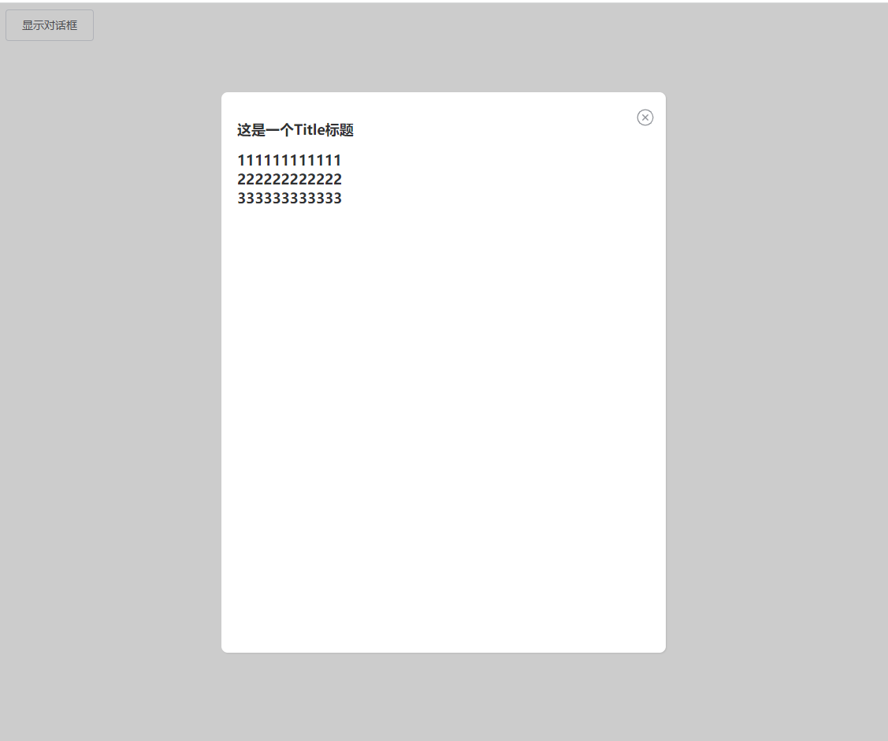

# Dialog 对话框



<details>
<summary>查看代码</summary>

```vue
<template>
  <Button @click="showDialog">显示对话框</Button>
  <Dialog v-model="toggle" title="这是一个Title标题" :beforeClose="beforeClose">
    <div>111111111111</div>
    <div>222222222222</div>
    <div>333333333333</div>
  </Dialog>
</template>

<script lang="ts" setup>
import { Button,Dialog } from "zgy-ui";
import { ref } from "vue";
const toggle = ref(false);
const showDialog = ()=>{
  toggle.value = true;
}
const beforeClose = (done: () => void)=>{
  done()
}
</script>
```

</details>

## Attributes

| 参数| 说明 |可选值|类型|默认值| 是否必填|
|-----| ----|-----|---|-------|----|
| modelValue| v-model 显示与隐藏 |- |boolean | false |是|
| title| 弹出框的标题 |- |string | '' |否|
| width| 弹出框的宽度 | % |string | '50%' |否|
| radius| 弹出框的边框圆角 | - |boolean | true |否|
| center| 是否居中 | - |boolean | false |否|
| showClose| 显示关闭按钮 | - |boolean | true |否|
| beforeClose| 关闭前的回调 | - | - | beforeClose?: (done: Function) => void |否|
