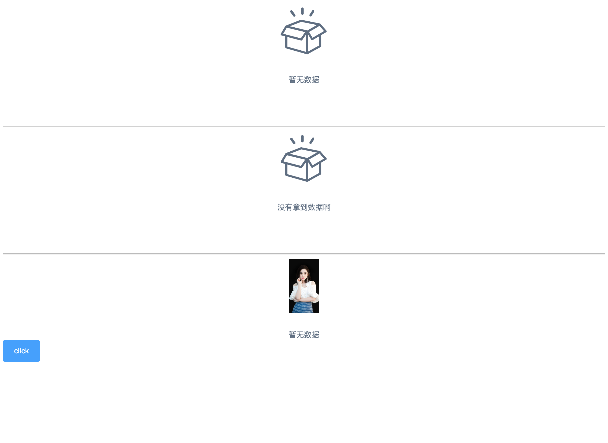

<!--
 * @Author: zhang_gen_yuan
 * @Date: 2023-08-21 14:28:07
 * @LastEditTime: 2023-08-21 14:30:27
 * @Descripttion: 
-->
# Empty 空状态




<details>
<summary>查看代码</summary>

```vue
<template>

  <Empty />

  <Empty description="没有拿到数据啊"/>

  <Empty image="https://gimg2.baidu.com/image_search/src=http%3A%2F%2Fc-ssl.duitang.com%2Fuploads%2Fitem%2F202002%2F28%2F20200228091421_yxtfb.jpg&refer=http%3A%2F%2Fc-ssl.duitang.com&app=2002&size=f9999,10000&q=a80&n=0&g=0n&fmt=auto?sec=1695190327&t=ec76d3fe4d16d697fda6831ea7de22ca">
    <Button type="primary">click</Button>
  </Empty>

</template>

<script lang="ts" setup>
import { Empty,Button } from 'zgy-ui'
</script>
```

</details>

## Attributes

| 参数| 说明 |可选值|类型|默认值| 是否必填|
|-----| ----|-----|---|-------|----|
| image| 自定义图片路径 |- |string |  | 否 |
| image-size| 自定义图片大小 |- |string | 100 | 否 |
| description | 文字描述 |- |string | 暂无数据 | 否 |

