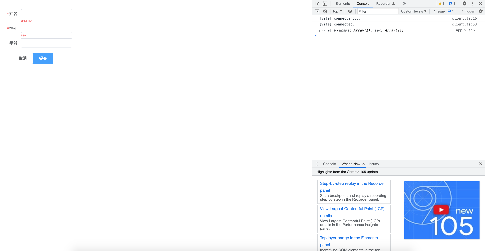

<!--
 * @Author: zhang_gen_yuan
 * @Date: 2022-09-11 19:02:06
 * @LastEditTime: 2022-10-05 19:01:09
 * @Descripttion:
-->

# Form 表单



<details>
<summary>查看代码</summary>

```vue
<template>
  <Form ref="ruleFormRef" :model="formData.model" :rules="formData.rules">
    <FormItem label="姓名" prop="uname">
      <Input v-model="formData.model.uname"></Input>
    </FormItem>
    <FormItem label="性别" prop="sex">
      <Input v-model="formData.model.sex"></Input>
    </FormItem>
    <FormItem label="年龄" prop="age">
      <Input v-model="formData.model.age"></Input>
    </FormItem>
    <FormItem>
      <div>
        <Button>取消</Button>
        <Button type="primary" @click="submit(ruleFormRef)">提交</Button>
      </div>
    </FormItem>
  </Form>
</template>

<script lang="ts" setup>
import { Form, FormItem, Input, Button } from "zgy-ui";
import { ref, reactive } from "vue";

const ruleFormRef = ref(null);
const formData = reactive({
  model: {
    uname: "",
    sex: "",
    age: "",
  },
  rules: {
    uname: [
      {
        required: true,
        message: "uname..",
      },
    ],
    sex: [
      {
        required: true,
        message: "sex..",
      },
    ],
  },
});

//提交
const submit = (ruleFormRef: any) => {
  if (!ruleFormRef) return;
  ruleFormRef.validate((valid: any, fields: any) => {
    if (valid) {
      console.log("submit!");
    } else {
      console.log("error!", fields);
    }
  });
};
</script>
```

</details>

## Attributes
| 参数| 说明 |可选值|类型|默认值| 是否必填|
|-----| ----|-----|---|-------|----|
| ref| HTMLDOMELEMENT | - |DOM| - |是|
| model| form | - |Object| - |是|
| rules| 规则 | - |Array| - |是|
| labelWidth| 表单label宽度 | - |string| auto |是|
