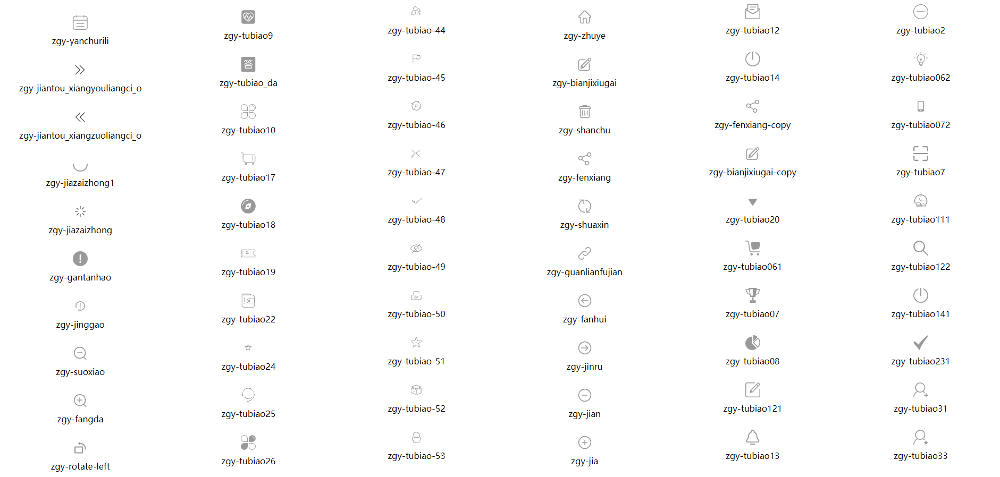
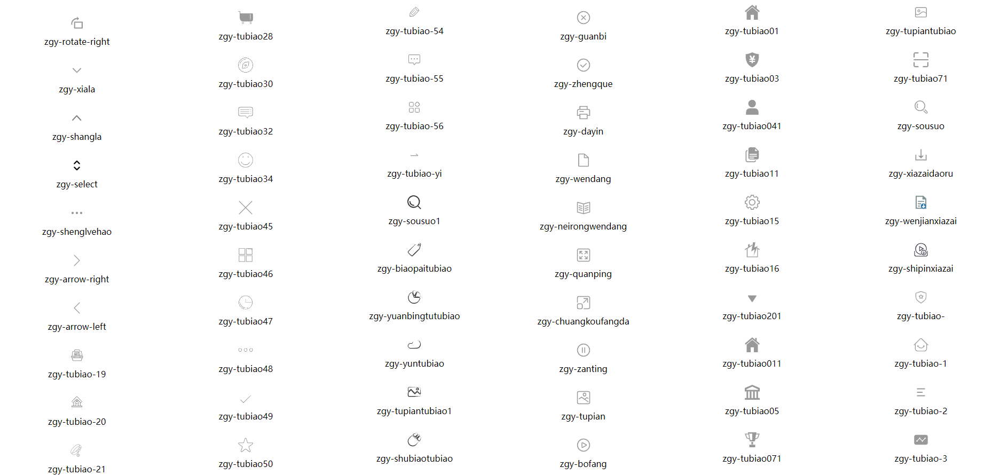
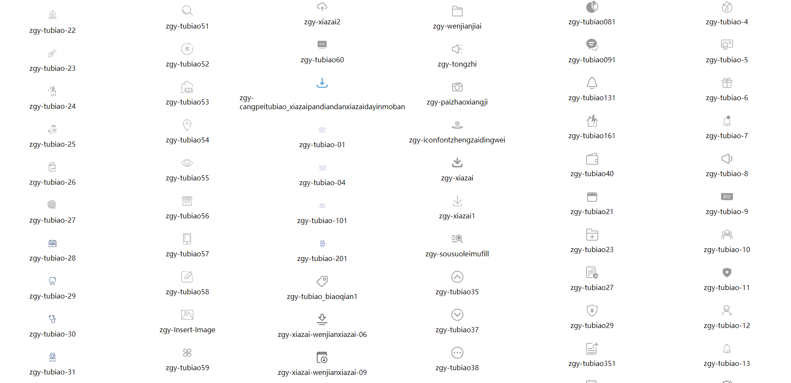
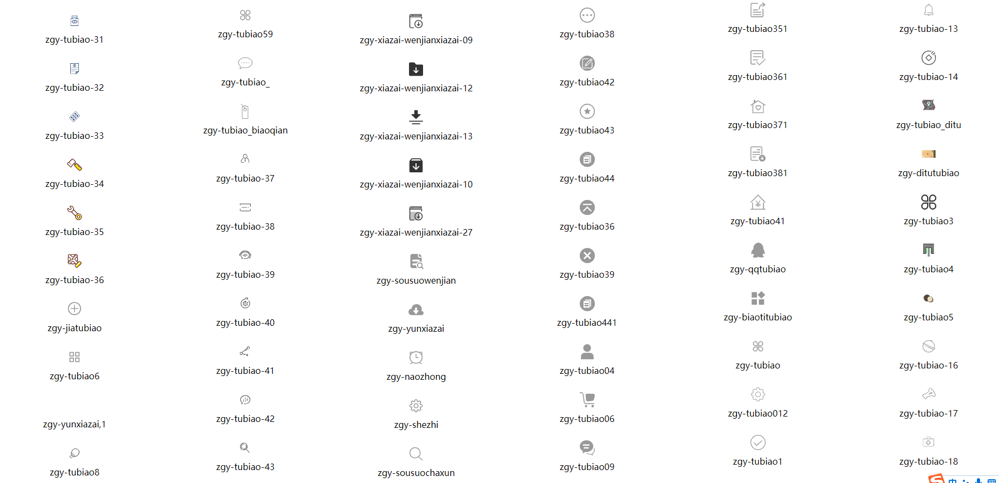

<!--
 * @Author: zhang_gen_yuan
 * @Date: 2022-09-09 23:24:05
 * @LastEditTime: 2022-09-11 15:56:21
 * @Descripttion:
-->

# Icon






<details>
<summary>查看更多</summary>

```vue
<template>
  <div class="box">
    <div v-for="iconName in iconList" :key="iconName">
      <Icon :name="iconName" color="#999" />
      <span>{{ iconName }}</span>
    </div>
  </div>
</template>

<script lang="ts" setup>
import { Icon } from "zgy-ui";
const iconList: string[] = ([
  "zgy-yanchurili",
  "zgy-jiantou_xiangyouliangci_o",
  "zgy-jiantou_xiangzuoliangci_o",
  "zgy-jiazaizhong1",
  "zgy-jiazaizhong",
  "zgy-gantanhao",
  "zgy-jinggao",
  "zgy-suoxiao",
  "zgy-fangda",
  "zgy-rotate-left",
  "zgy-rotate-right",
  "zgy-xiala",
  "zgy-shangla",
  "zgy-select",
  "zgy-shenglvehao",
  "zgy-arrow-right",
  "zgy-arrow-left",
  "zgy-tubiao-19",
  "zgy-tubiao-20",
  "zgy-tubiao-21",
  "zgy-tubiao-22",
  "zgy-tubiao-23",
  "zgy-tubiao-24",
  "zgy-tubiao-25",
  "zgy-tubiao-26",
  "zgy-tubiao-27",
  "zgy-tubiao-28",
  "zgy-tubiao-29",
  "zgy-tubiao-30",
  "zgy-tubiao-31",
  "zgy-tubiao-32",
  "zgy-tubiao-33",
  "zgy-tubiao-34",
  "zgy-tubiao-35",
  "zgy-tubiao-36",
  "zgy-jiatubiao",
  "zgy-tubiao6",
  "zgy-yunxiazai,1",
  "zgy-tubiao8",
  "zgy-tubiao9",
  "zgy-tubiao_da",
  "zgy-tubiao10",
  "zgy-tubiao17",
  "zgy-tubiao18",
  "zgy-tubiao19",
  "zgy-tubiao22",
  "zgy-tubiao24",
  "zgy-tubiao25",
  "zgy-tubiao26",
  "zgy-tubiao28",
  "zgy-tubiao30",
  "zgy-tubiao32",
  "zgy-tubiao34",
  "zgy-tubiao45",
  "zgy-tubiao46",
  "zgy-tubiao47",
  "zgy-tubiao48",
  "zgy-tubiao49",
  "zgy-tubiao50",
  "zgy-tubiao51",
  "zgy-tubiao52",
  "zgy-tubiao53",
  "zgy-tubiao54",
  "zgy-tubiao55",
  "zgy-tubiao56",
  "zgy-tubiao57",
  "zgy-tubiao58",
  "zgy-Insert-Image",
  "zgy-tubiao59",
  "zgy-tubiao_",
  "zgy-tubiao_biaoqian",
  "zgy-tubiao-37",
  "zgy-tubiao-38",
  "zgy-tubiao-39",
  "zgy-tubiao-40",
  "zgy-tubiao-41",
  "zgy-tubiao-42",
  "zgy-tubiao-43",
  "zgy-tubiao-44",
  "zgy-tubiao-45",
  "zgy-tubiao-46",
  "zgy-tubiao-47",
  "zgy-tubiao-48",
  "zgy-tubiao-49",
  "zgy-tubiao-50",
  "zgy-tubiao-51",
  "zgy-tubiao-52",
  "zgy-tubiao-53",
  "zgy-tubiao-54",
  "zgy-tubiao-55",
  "zgy-tubiao-56",
  "zgy-tubiao-yi",
  "zgy-sousuo1",
  "zgy-biaopaitubiao",
  "zgy-yuanbingtutubiao",
  "zgy-yuntubiao",
  "zgy-tupiantubiao1",
  "zgy-shubiaotubiao",
  "zgy-xiazai2",
  "zgy-tubiao60",
  "zgy-cangpeitubiao_xiazaipandiandanxiazaidayinmoban",
  "zgy-tubiao-01",
  "zgy-tubiao-04",
  "zgy-tubiao-101",
  "zgy-tubiao-201",
  "zgy-tubiao_biaoqian1",
  "zgy-xiazai-wenjianxiazai-06",
  "zgy-xiazai-wenjianxiazai-09",
  "zgy-xiazai-wenjianxiazai-12",
  "zgy-xiazai-wenjianxiazai-13",
  "zgy-xiazai-wenjianxiazai-10",
  "zgy-xiazai-wenjianxiazai-27",
  "zgy-sousuowenjian",
  "zgy-yunxiazai",
  "zgy-naozhong",
  "zgy-shezhi",
  "zgy-sousuochaxun",
  "zgy-zhuye",
  "zgy-bianjixiugai",
  "zgy-shanchu",
  "zgy-fenxiang",
  "zgy-shuaxin",
  "zgy-guanlianfujian",
  "zgy-fanhui",
  "zgy-jinru",
  "zgy-jian",
  "zgy-jia",
  "zgy-guanbi",
  "zgy-zhengque",
  "zgy-dayin",
  "zgy-wendang",
  "zgy-neirongwendang",
  "zgy-quanping",
  "zgy-chuangkoufangda",
  "zgy-zanting",
  "zgy-tupian",
  "zgy-bofang",
  "zgy-wenjianjiai",
  "zgy-tongzhi",
  "zgy-paizhaoxiangji",
  "zgy-iconfontzhengzaidingwei",
  "zgy-xiazai",
  "zgy-xiazai1",
  "zgy-sousuoleimufill",
  "zgy-tubiao35",
  "zgy-tubiao37",
  "zgy-tubiao38",
  "zgy-tubiao42",
  "zgy-tubiao43",
  "zgy-tubiao44",
  "zgy-tubiao36",
  "zgy-tubiao39",
  "zgy-tubiao441",
  "zgy-tubiao04",
  "zgy-tubiao06",
  "zgy-tubiao09",
  "zgy-tubiao12",
  "zgy-tubiao14",
  "zgy-fenxiang-copy",
  "zgy-bianjixiugai-copy",
  "zgy-tubiao20",
  "zgy-tubiao061",
  "zgy-tubiao07",
  "zgy-tubiao08",
  "zgy-tubiao121",
  "zgy-tubiao13",
  "zgy-tubiao01",
  "zgy-tubiao03",
  "zgy-tubiao041",
  "zgy-tubiao11",
  "zgy-tubiao15",
  "zgy-tubiao16",
  "zgy-tubiao201",
  "zgy-tubiao011",
  "zgy-tubiao05",
  "zgy-tubiao071",
  "zgy-tubiao081",
  "zgy-tubiao091",
  "zgy-tubiao131",
  "zgy-tubiao161",
  "zgy-tubiao40",
  "zgy-tubiao21",
  "zgy-tubiao23",
  "zgy-tubiao27",
  "zgy-tubiao29",
  "zgy-tubiao351",
  "zgy-tubiao361",
  "zgy-tubiao371",
  "zgy-tubiao381",
  "zgy-tubiao41",
  "zgy-qqtubiao",
  "zgy-biaotitubiao",
  "zgy-tubiao",
  "zgy-tubiao012",
  "zgy-tubiao1",
  "zgy-tubiao2",
  "zgy-tubiao062",
  "zgy-tubiao072",
  "zgy-tubiao7",
  "zgy-tubiao111",
  "zgy-tubiao122",
  "zgy-tubiao141",
  "zgy-tubiao231",
  "zgy-tubiao31",
  "zgy-tubiao33",
  "zgy-tupiantubiao",
  "zgy-tubiao71",
  "zgy-sousuo",
  "zgy-xiazaidaoru",
  "zgy-wenjianxiazai",
  "zgy-shipinxiazai",
  "zgy-tubiao-",
  "zgy-tubiao-1",
  "zgy-tubiao-2",
  "zgy-tubiao-3",
  "zgy-tubiao-4",
  "zgy-tubiao-5",
  "zgy-tubiao-6",
  "zgy-tubiao-7",
  "zgy-tubiao-8",
  "zgy-tubiao-9",
  "zgy-tubiao-10",
  "zgy-tubiao-11",
  "zgy-tubiao-12",
  "zgy-tubiao-13",
  "zgy-tubiao-14",
  "zgy-tubiao_ditu",
  "zgy-ditutubiao",
  "zgy-tubiao3",
  "zgy-tubiao4",
  "zgy-tubiao5",
  "zgy-tubiao-16",
  "zgy-tubiao-17",
  "zgy-tubiao-18",
])

</script>

```

</details>

## Attributes
  <!-- name: string;
  dot?: boolean;
  badge?: string;
  color?: string;
  size?: string|number; -->
| 参数| 说明 |可选值|类型|默认值| 是否必填 |
|-----| ----|-----|---|-------|----|
| name| icon名称 | - |string|- | 是 |
| dot| 标记红点 | - |boolean|- |否|
| badge| 数字角标 | - |string|- |否|
| color| icon颜色 | - |-|#666 |否|
| size| icon大小 | - |-|28px |否|