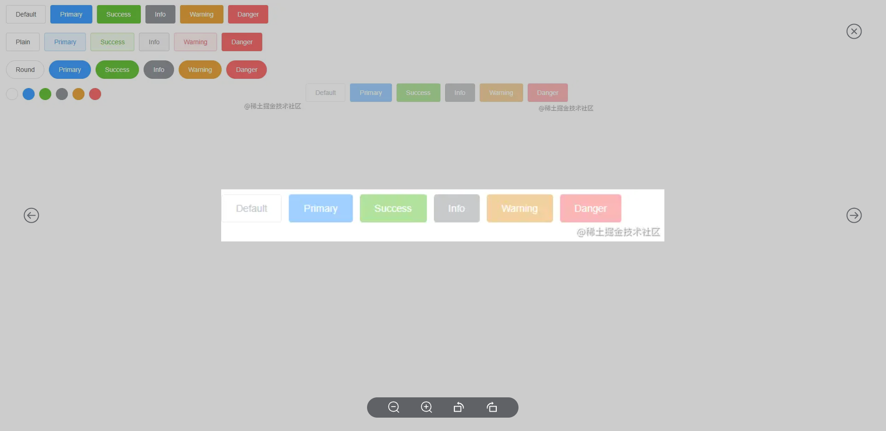

<!--
 * @Author: zhang_gen_yuan
 * @Date: 2022-09-11 23:49:46
 * @LastEditTime: 2022-09-12 10:31:22
 * @Descripttion: 
-->
# Image 图片

<!--  -->


<details>
<summary>查看代码</summary>

```vue
<template>
  <Image
    :previewList="images"
    v-for="(item, index) in images"
    :key="index"
    :index="index"
    :src="item"
    mode="widthFix"
    style="width:200px;"
  />
</template>

<script setup>
import { Image } from "zgy-ui";
import { ref } from "vue";
const images = ref([
  'https://img0.baidu.com/it/u=734685046,1518364176&fm=253&fmt=auto&app=138&f=JPEG?w=500&h=889',
  'https://img2.baidu.com/it/u=581448092,3902451155&fm=253&fmt=auto&app=138&f=JPEG?w=400&h=611'
]);
</script>
```

</details>

## Attributes
   <!-- src: string;
    fit?: string;
    alt?: string;
    loading?: string;
    previewList?: Array<string>;
    index?: number;
    closeEscape:boolean -->
| 参数| 说明 |可选值|类型|默认值| 是否必填 |
|-----| ----|-----|---|-------|----|
| src| 图片地址 | - |string|- | 是 |
| fit| 对图片进行剪切 | object-fit属性【fill,contain,cover,scale-down,none,initial,inherit】 |string|- |否|
| alt| 原生属性 | - |string|- |否|
| loading| loading | - |boolean|- |否|
| previewList| 图片地址数组 | - |string[]|- |否|
| index| 数组下标 | - |number| 0 |否|
| closeEscape| 是否键盘Esc关闭 | - |boolean| true |否|