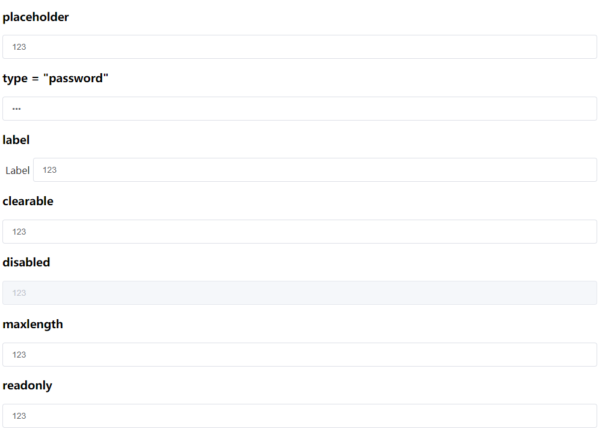

<!--
 * @Author: zhang_gen_yuan
 * @Date: 2022-09-18 17:34:41
 * @LastEditTime: 2022-09-18 17:38:51
 * @Descripttion: 
-->
# Input 输入框



<details>
<summary>查看代码</summary>

```vue
<template>

  <h3>placeholder</h3>
  <Input v-model="val" placeholder="请输入..." />

  <h3>type = "password"</h3>
  <Input v-model="val" type="password" placeholder="请输入..."/>

  <h3>clearable</h3>
  <Input v-model="val" clearable placeholder="请输入..."/>

  <h3>disabled</h3>
  <Input v-model="val" disabled clearable placeholder="请输入..."/>

  <h3>maxlength</h3>
  <Input v-model="val" maxlength="5" clearable placeholder="请输入..."/>

  <h3>readonly</h3>
  <Input v-model="val" readonly placeholder="请输入..."/>
  
</template>

<script lang="ts" setup>
import { Input,Button } from "zgy-ui";
import { ref } from "vue";

let val = ref<string>("123")

</script>
```

</details>


## Attributes

| 参数| 说明 |可选值|类型|默认值| 是否必填|
|-----| -------|-----|---|-------|----|
| placeholder| 占位符 | - |string | - |否|
| modelValue / v-model| 绑定值 | - |string/number | - |是|
| type| 原生属性[类型] | - |text，textarea 和其他 | text |否|
| clearable| 是否可清空 | - |boolean | false |否|
| disabled| 是否禁用 | - |boolean | false |否|
| maxlength| 最大输入长度 | - |string / number | - |否|
| minlength| 最小输入长度 | - |string / number | - |否|
| max| 原生 max 属性，设置最大值 | - |- | - |否|
| min| 原生属性，设置最小值 | - | - | - |否|
| readonly| 原生  readonly 属性，是否只读 | - |boolean| false |否|
| prefixIcon| 输入框前方Icon图标 | - |string| - |否|
| prefixSize| Icon大小 | - |string/number| 14 |否|
