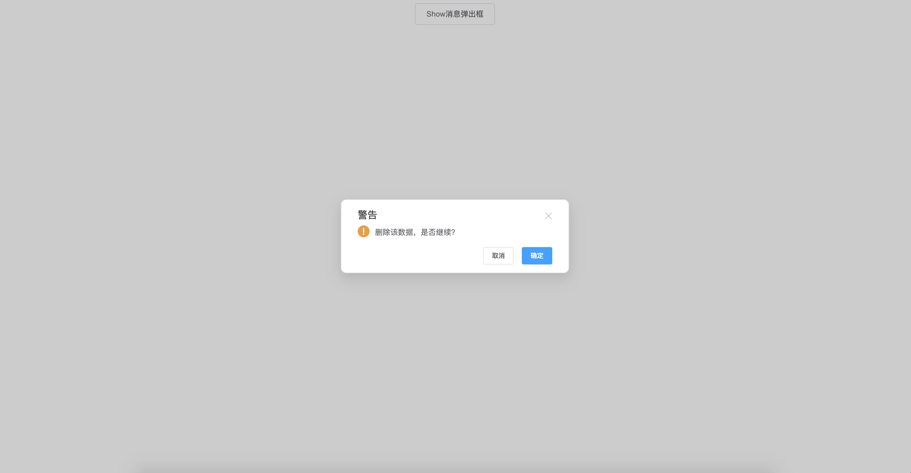

<!--
 * @Author: zhang_gen_yuan
 * @Date: 2022-09-11 16:31:20
 * @LastEditTime: 2022-09-12 10:34:21
 * @Descripttion: 
-->
# MessageBox 消息弹出框
<!-- 
 -->



<details>
<summary>查看代码</summary>

```vue
<template>
  <div>
    <Button @click="click">Show消息弹出框</Button>
  </div>
</template>

<script lang="ts" setup>
import { Button, MessageBox } from "zgy-ui";
const click = () => {
  MessageBox({ title:"警告",message: "删除该数据，是否继续？",confirmButtonText:"确认",cancelButtonText:"取消",showClose:true, cancel: () => {}, confirm: () => {} });
};
</script>
```
</details>

## Attributes

| 参数| 说明 |可选值|类型|默认值| 是否必填 |
|-----| ----|-----|---|-------|------|
| title| 标题 | - |string| '警告' | 否 |
| message| 主体信息 | - |string| '这是一条确认框的消息' |否|
|confirmButtonText|确定按钮文案| - |string| 确定 |否|
|cancelButtonText|取消按钮文案| - |string| 取消 |否|
|showClose|右上角关闭图标| - |boolean| true |否|
|cancel|取消事件| - |Function|  |是|
|confirm|确定事件| - |Function|  |是|
