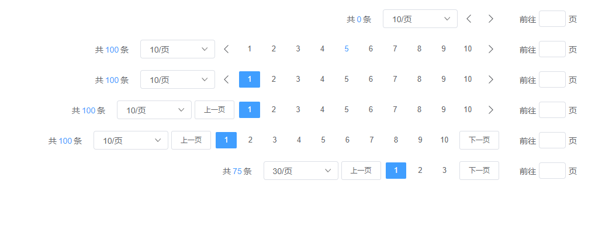

# Paging 分页



<details>
<summary>查看代码</summary>

```vue
<template>
  <Paging />
  <Paging :total="100" :size="10" :current="5"/>
  <Paging :total="100" background/>
  <Paging :total="100" background prevText="上一页"/>
  <Paging :total="100" background prevText="上一页" nextText="下一页"/>
  <Paging :total="75" background prevText="上一页" :size="30" nextText="下一页" :pageSizes="pageSizes"/>
</template>

<script lang="ts" setup>
import { Paging } from "zgy-ui";
import { ref } from "vue";

const pageSizes = ref([
{ label: "30/页", value: 30 },
{ label: "40/页", value: 40 },
])

</script>
```

</details>

## Attributes

| 参数| 说明 |可选值|类型|默认值| 是否必填|
|-----| -------|-----|---|-------|----|
| total| 总条数 | - |number | 0 |是|
| size| 一页条数 | - | number | 10 |是|
| prevText| 上一页 | - | string | Icon |否|
| nextText| 下一页 | - | string | Icon |否|
| background| 背景色 | - | boolean | false |否|
| pageSizes| - | - | [ { label: "10/页", value: 10 },{ label: "20/页", value: 20 },{ label: "50/页", value: 50 },{ label: "100/页", value: 100 }] | false |否|