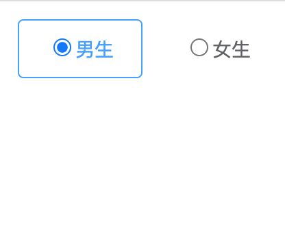

<!--
 * @Author: zhang_gen_yuan
 * @Date: 2022-09-12 22:42:37
 * @LastEditTime: 2023-08-25 08:51:04
 * @Descripttion: 
-->
# Radio 单选框




<details>
<summary>查看代码</summary>

```vue
<script setup lang="ts">
import { Radio } from "zgy-ui"
import { ref } from "vue";
const val = ref("1")

</script>
<template>
  <Radio v-model="val" border label="1">男生</Radio>
  <Radio v-model="val" label="0">女生</Radio>
</template>
```

</details>

## Attributes

| 参数| 说明 |可选值|类型|默认值| 是否必填|
|-----| ----|-----|---|-------|----|
| v-model| 绑定值 |- | string,number,boolean | '' | 否 |
| label| Radio 的 value |- |string,number,boolean | '' | 否 |
| border| 是否显示边框 |  | boolean | false | 否 |
| disabled | 是否禁用 |- |boolean | false | 否 |
