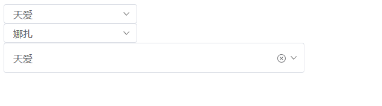

# Select 选择器




<details>
<summary>查看代码</summary>

```vue
<template>
  <Select :options="options" v-model="selectvalue"></Select>
  <Select :options="options" v-model="selectvalue2" clearable></Select>
  <Select :options="options" v-model="selectvalue" clearable :width="500" :height="50"></Select>
</template>

<script lang="ts" setup>
import { Select } from "zgy-ui";
import { ref } from "vue";

const selectvalue = ref("1")
const selectvalue2 = ref("2")

const options = ref([
  {
    label:"天爱",
    value:1
  },
  {
    label:"娜扎",
    value:2
  },
])

</script>
```

</details>


## Attributes

| 参数| 说明 |可选值|类型|默认值| 是否必填|
|-----| -------|-----|---|-------|----|
| placeholder| 占位符 | - |string | "" |否|
| modelValue| v-model | - |string | "" |是|
| width| 宽度 | - |number | 222 |否|
| height| 高度 | - |number | 32 |否|
| clearable| 显示关闭 | - |boolean | false |否|
| options| selectItem | - | []OptionsProps | - |是|

## OptionsProps

| 参数| 说明 |可选值|类型|默认值| 是否必填|
|-----| -------|-----|---|-------|----|
| label| 选项的文字 | - |string | - |是|
| value| 选项的值 | - | number | - |是|
| [key: string]| - | - | any | - |否|

