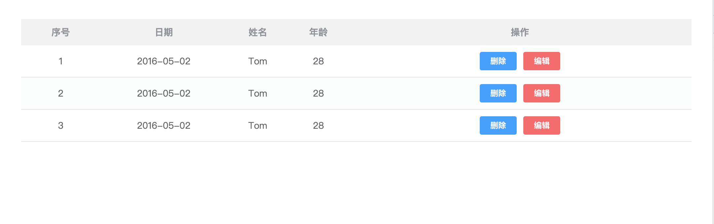
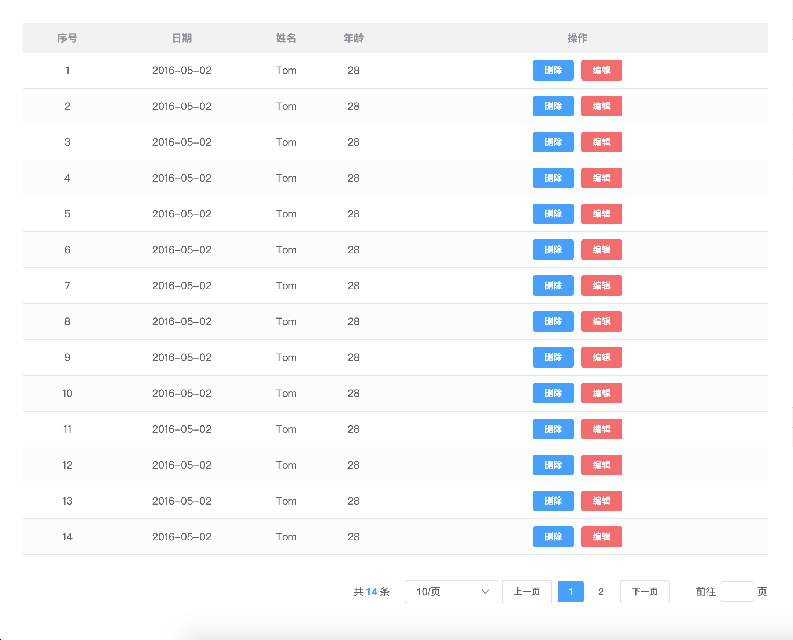

<!--
 * @Author: zhang_gen_yuan
 * @Date: 2022-09-11 19:02:06
 * @LastEditTime: 2022-10-05 18:09:19
 * @Descripttion:
-->

# Table 表格



<details>
<summary>查看代码</summary>

```vue
<template>
  <Table
    :columns="columns"
    :data="tableData"
    sequence
    sequence-label="序号"
    sequence-width="100"
    size="mini"
  >
    <template #operation="{ $scope }">
      <Button type="primary" size="mini" @click="del($scope)">删除</Button>
      <Button type="danger" size="mini" style="margin-left:10px;">编辑</Button>
    </template>
  </Table>
  <Paging
    :total="tableData.length"
    background
    prevText="上一页"
    :size="30"
    nextText="下一页"
    :pageSizes="pageSizes"
  />
</template>

<script lang="ts" setup>
import { Button, Table } from "zgy-ui";
import { ref, reactive } from "vue";

const columns = ref([
  {
    label: "日期",
    prop: "date",
  },
  {
    label: "姓名",
    prop: "name",
  },
  {
    label: "年龄",
    prop: "age",
  },
  {
    label: "操作",
    prop: "operation",
    width: "500",
  },
]);

const tableData = ref([
  {
    date: "2016-05-02",
    name: "Tom",
    age: 28,
  },
  {
    date: "2016-05-02",
    name: "Tom",
    age: 28,
  },
  {
    date: "2016-05-02",
    name: "Tom",
    age: 28,
  },
]);

const del = (item: any) => {
  console.log(item);
};
</script>
```

</details>

### 和分页组件 Paging 联动



<details>
<summary>查看代码</summary>

```vue
<template>
  <Table
    :columns="columns"
    :data="tableData"
    sequence
    sequence-label="序号"
    sequence-width="100"
    size="mini"
  >
    <template #operation="{ $scope }">
      <Button type="primary" size="mini" @click="del($scope)">删除</Button>
      <Button type="danger" size="mini" style="margin-left:10px;">编辑</Button>
    </template>
  </Table>
  <Paging
    :total="tableData.length"
    background
    prevText="上一页"
    :size="30"
    nextText="下一页"
    :pageSizes="pageSizes"
  />
</template>

<script lang="ts" setup>
import { Button, Table, Paging } from "zgy-ui";
import { ref, reactive } from "vue";

const pageSizes = ref([
  { label: "10/页", value: 10 },
  { label: "20/页", value: 20 },
  { label: "30/页", value: 30 },
  { label: "40/页", value: 40 },
]);

const columns = ref([
  {
    label: "日期",
    prop: "date",
  },
  {
    label: "姓名",
    prop: "name",
  },
  {
    label: "年龄",
    prop: "age",
  },
  {
    label: "操作",
    prop: "operation",
    width: "500",
  },
]);

const tableData = ref([
  {
    date: "2016-05-02",
    name: "Tom",
    age: 28,
  },
  {
    date: "2016-05-02",
    name: "Tom",
    age: 28,
  },
  {
    date: "2016-05-02",
    name: "Tom",
    age: 28,
  },
  {
    date: "2016-05-02",
    name: "Tom",
    age: 28,
  },
  {
    date: "2016-05-02",
    name: "Tom",
    age: 28,
  },
  {
    date: "2016-05-02",
    name: "Tom",
    age: 28,
  },
  {
    date: "2016-05-02",
    name: "Tom",
    age: 28,
  },
  {
    date: "2016-05-02",
    name: "Tom",
    age: 28,
  },
  {
    date: "2016-05-02",
    name: "Tom",
    age: 28,
  },
  {
    date: "2016-05-02",
    name: "Tom",
    age: 28,
  },
  {
    date: "2016-05-02",
    name: "Tom",
    age: 28,
  },
  {
    date: "2016-05-02",
    name: "Tom",
    age: 28,
  },
  {
    date: "2016-05-02",
    name: "Tom",
    age: 28,
  },
  {
    date: "2016-05-02",
    name: "Tom",
    age: 28,
  },
]);

const del = (item: any) => {
  console.log(item);
};
</script>
```

</details>

## Attributes

| 参数 | 说明 | 可选值 | 类型 | 默认值 | 是否必填 |
| - |- | - | - | - | - |
| columns| Array[Columns] |-|数组|-|是|
| data| Array[key:string]:any |-|数组|-|是|
| width| 表格宽度 |-|string|100%|否|
| height| 表格高度 |-|string|100%|否|
| align| 左中右 |-|string|center|否|
| size| - | mini/small/large |string|small|否|
| sequence| 是否开启序号 | - |boolean|false|否|
| sequenceLabel| 开启排序的表头 | - |string|序号|否|
| sequenceWidth| 排序表头的宽度 | - |string|100px|否|


## Columns
| 参数 | 说明 | 可选值 | 类型 | 默认值 | 是否必填 |
| - |- | - | - | - | - |
| label | 表头 | - | string | - | 是 |
| prop | 对应表头字段 | - | string | - | 是 |
| width | 对应表头对饮td宽度 | - | string | auto | 否 |

