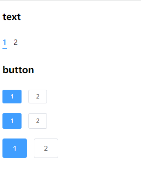

# Tabs 标签页



<details>
<summary>查看代码</summary>

```vue
<template>
  <div>
    <h3>text</h3>
    <Tabs v-model="tabValue" :tabList="tabList"></Tabs>
  </div>
  <div>
    <h3>button</h3>
    <Tabs v-model="tabValue" type="button" size="mini" :tabList="tabList"></Tabs>
    <Tabs v-model="tabValue" type="button" size="small" :tabList="tabList"></Tabs>
    <Tabs v-model="tabValue" type="button" size="midium" :tabList="tabList"></Tabs>
  </div>
</template>

<script lang="ts" setup>
import { Tabs } from "zgy-ui";
import { ref } from "vue";
let tabValue = ref<string>("1")
let tabList = ref([
  {
    label: "1",
    value: 1
  },
  {
    label: "2",
    value: 2
  }
])
</script>
```

</details>

## Attributes

| 参数| 说明 |可选值|类型|默认值| 是否必填|
|-----| -------|-----|---|-------|----|
| type| 类型 | 'text' , 'card' , 'button' |string | text |否|
| modelValue| v-model | - | string | - |是|
| tabList| - | - | LabelsProps[] | - |是|
| size| 大小 | "small","mini" |  | small |否|

## LabelsProps

| 参数| 说明 |可选值|类型|默认值| 是否必填|
|-----| -------|-----|---|-------|----|
| label| 标题 | - |string | "" |是|
| value| 值 | - | string or number | "" |是|
