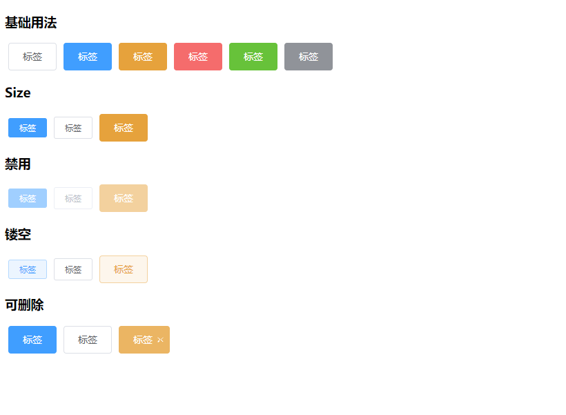

# Tag 标签



<details>
<summary>查看代码</summary>

```vue
<template>
  <div>
    <h3>基础用法</h3>
    <Tag type="">标签</Tag>
    <Tag type="primary">标签</Tag>
    <Tag type="warning">标签</Tag>
    <Tag type="danger">标签</Tag>
    <Tag type="success">标签</Tag>
    <Tag type="info">标签</Tag>
  </div>
  <div>
    <h3>Size</h3>
    <Tag type="primary" size="mini">标签</Tag>
    <Tag type="" size="small">标签</Tag>
    <Tag type="warning" size="midium">标签</Tag>
  </div>
  <div>
    <h3>禁用</h3>
    <Tag type="primary" size="mini" disabled>标签</Tag>
    <Tag type="" size="small" disabled>标签</Tag>
    <Tag type="warning" size="midium" disabled>标签</Tag>
  </div>
  <div>
    <h3>镂空</h3>
    <Tag type="primary" size="mini" plain>标签</Tag>
    <Tag type="" size="small" plain>标签</Tag>
    <Tag type="warning" size="midium" plain>标签</Tag>
  </div>
  <div>
    <h3>可删除</h3>
    <Tag type="primary" closable>标签</Tag>
    <Tag type="" closable>标签</Tag>
    <Tag type="warning" size="midium" closable>标签</Tag>
  </div>
</template>

<script lang="ts" setup>
import { Tag } from "zgy-ui";
</script>

<style></style>
```

</details>

## Attributes

| 参数| 说明 |可选值|类型|默认值| 是否必填|
|-----| -------|-----|---|-------|----|
| type| tag类型 | "primary", "success", "info", "warning", "danger", "text" |string | default |否|
| size| 大小 | "midium", "small", "mini" |string | midium |否|
| disabled| 禁用 | - | boolean | false |否|
| plain| 镂空 | - | boolean | false |否|
| closable| 可删除 | - | boolean | false |否|